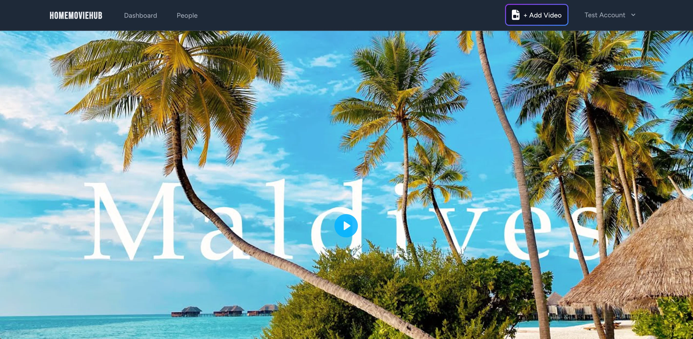

<div align="center">
    
</div>

<div align="center">
<h1>HOMEMOVIEHUB</h1>
</div>

<h4 align="center">
  <a href="https://homemoviehub.com">Live Demo</a> |
  <a href="#features">Features</a> |
  <a href="#quick-start">Quick Start</a>
</h4>

<div align="center">
  <h2>
    A Netflix-like streaming experience for home movies built with Vue.js and Laravel. </br>
    Create a safe place to store and share your precious family moments. </br>
  <br />
  </h2>
</div>

<br />
<p align="center">
  <a href="https://github.com/dandyson/homemoviehub/blob/master/LICENSE">
    
  </a>
  <a href="https://github.com/dandyson/homemoviehub/pulls">
    
  </a>
  <a href="https://github.com/dandyson/homemoviehub/issues">
    
  </a>
</p>

<div align="center">
  <figure>
    
    <figcaption>
      <p align="center">
        A beautiful, intuitive interface designed for sharing family memories.
      </p>
    </figcaption>
  </figure>
</div>

## Features

HomeMovieHub provides a comprehensive suite of features for managing home movies:

- 🎬 **Netflix-like UI**: Beautiful and family-friendly interface for easy navigation
- 👨‍👩‍👧‍👦 **Personal Profiles**: Create profiles for each family member
- 📍 **Location Tracking**: Integrated Google Maps to pin video locations
- 🔒 **Secure Storage**: Safe place for your precious family moments
- 🎥 **Video Management**: Organize and categorize your home movies

## Technical Excellence

HomeMovieHub is built with a focus on technical excellence and best practices:

- 🚀 **Modern Stack**: Built with Vue 3 and Laravel 10, utilizing the latest features and optimizations
- 🧪 **Testing**: Comprehensive test coverage for both frontend and backend components
- 🔄 **CI/CD**: Automated testing and deployment pipeline for reliable releases
- 📦 **Containerization**: Docker-based development environment with Laravel Sail
- 🔒 **Security**: Production-grade authentication with Auth0 integration
- 📱 **Responsive Design**: Optimized for all devices and screen sizes
- 🛠️ **Developer Experience**: Well-documented codebase and streamlined development workflow

## Quick Start

**Note:** These instructions are for running HomeMovieHub locally. The app is currently just a demo version, so some of the features (such as registering users) has been turned off.

### Prerequisites

- Docker and Docker Compose
- Node.js (LTS version)
- Composer

### Installation

1. Clone the repository:
```bash
git clone https://github.com/dandyson/homemoviehub.git
cd homemoviehub
```

2. Configure environment:
```bash
cp .env.example .env
```

3. Start the development environment:
```bash
./vendor/bin/sail up -d
```

4. Install dependencies and run migrations:
```bash
./vendor/bin/sail composer install
./vendor/bin/sail npm install
./vendor/bin/sail artisan migrate
```

5. Start the development server:
```bash
./vendor/bin/sail npm run dev
```

Visit http://localhost to see your local instance running!

## Future Planned Updates

- **Email Verification**: Enhanced security for private family content
- **Enhanced User Profiles**: Family accounts with individual member profiles
- **Enhanced Maps**: Add notes and pictures to map location pins
- **Code Improvements**: Refined UI and optimized codebase
- **CI/CD Implementation**: Frontend testing and automated deployment

## Technical Stack

- **Frontend**: Vue.js, Vue Router, Vite
- **Backend**: Laravel, PHP
- **Database**: MySQL
- **Maps**: Google Maps API
- **Containerization**: Docker, Laravel Sail
- **Authentication**: Auth0 (Production)

## Contributing

We welcome contributions! Here's how you can help:

- Found a bug? [Report it here](https://github.com/dandyson/homemoviehub/issues)
- Have a feature request? [Open an issue](https://github.com/dandyson/homemoviehub/issues)

## License

HomeMovieHub is open-source software licensed under the [MIT license](LICENSE).
